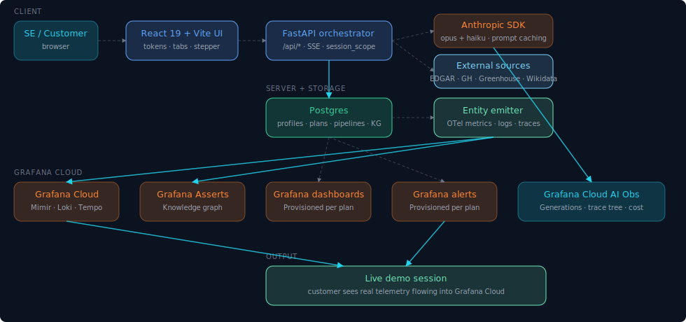

# Proj Clarion

**Type in a company website. Get a working Grafana Cloud demo for them — dashboards, alerts, entity graph, sample data — in a few minutes.**

Built for Grafana Solutions Engineers (or anyone) who needs to show a prospect "here's what observability could look like for you" without spending days setting up a custom environment.

> Clarion only reads public information about a company. It never touches their real systems. Every dashboard it creates carries an "illustrative demo" disclaimer.

## Architecture



A FastAPI orchestrator drives a six-phase pipeline through Anthropic Claude and a handful of free public sources (SEC EDGAR, GitHub orgs, Greenhouse, Lever, Wikidata). Outputs land in Postgres; an entity emitter pushes synthetic OTel telemetry to Grafana Cloud (Mimir / Loki / Tempo / Asserts / Dashboards / Alerts). Every LLM call is instrumented through a single wrapper (`observability/llm_client.py`) that emits `gen_ai.*` semantic-convention spans plus Clarion enrichment (cost, cache savings, TTFT, pipeline phase, prompt template) — so the **Grafana Cloud AI Observability** app sees the agent in full detail, and Clarion's own dashboard layers per-pipeline rollups on top.

## How it works

1. You give Clarion a URL.
2. Claude researches the company from public web sources — homepage, SEC 10-K (item 1/1A/7), GitHub org if any, Greenhouse + Lever job boards, Wikidata.
3. A planning agent classifies the company's organisational archetype (retail / b2b-industrial / healthcare-provider / saas / financial / media / logistics / generic) and designs a vertical-tuned demo.
4. Synthetic telemetry flows to your Grafana Cloud stack.
5. You get a live demo that looks like the prospect's own operations, ready in under 10 minutes.

## What makes it different from the built-in Grafana AI Obs app

The built-in AI Obs app gives you the **generic gen-AI layer**: spans in Tempo, token/cost metrics in Mimir, Anthropic call view. Clarion is the **operational story on top**:

- **Per-pipeline rollups** — every span carries `clarion.pipeline.id` + `clarion.pipeline.phase`. The build is the unit of work.
- **Cost by prompt template** — knowing which template costs the most, not just which model.
- **Structural evals** (`llm_evals` table) — did the agent's output validate? The AI Obs app doesn't store that.
- **Tool-call audit + policy violations** — cost spikes, runaway output, prompt-injection patterns, out-of-scope tool calls. The regulated-buyer audit story.
- **System health heartbeat** — postgres / Anthropic / Grafana Cloud probed every 60s; visible alongside the agent's own behaviour.
- **SE adoption KPIs** — none of this is in the AI Obs app; it's the business-side custom dashboard.

The companion dashboard (`grafana/clarion-dashboard.json`-equivalent in your stack) demonstrates exactly this layering — five tabs (Overview / Pipelines / AI & LLM / Guardrails & Health / Adoption) telling the dev→prod readiness story over one shared OTLP stream.

## What you need

- Mac or Linux
- Docker Desktop
- Python 3.11+ and Node 18+
- An [Anthropic API key](https://console.anthropic.com/settings/keys)
- A [Grafana Cloud account](https://grafana.com/auth/sign-up/create-user) — free tier works

Two small helper tools:

```bash
curl -LsSf https://astral.sh/uv/install.sh | sh   # uv (Python package manager)
brew install just                                   # just (task runner)
```

## Quick start

```bash
# 1. Clone and install
git clone https://github.com/imran4z/proj-clarion
cd proj-clarion
just install                  # Python deps
(cd ui && npm install)        # UI deps

# 2. Start the stack
just up                       # Postgres in Docker
just api                      # FastAPI backend on :8765 (terminal 1)
(cd ui && npm run dev)        # Vite frontend on :5173 (terminal 2)

# 3. Open http://127.0.0.1:5173
```

**First time you open the UI**, a setup wizard appears. Paste your Anthropic key + Grafana Cloud credentials (or drag-drop a `.env` file from another machine), hit **Test** on each field, click **Save & launch**. The app loads.

From there, click **New build**, paste a company URL, and watch the six phases run:

```
Research → Plan → Approve → Generate → Provision → KG publish
```

When it finishes, you'll have a fresh demo folder in your Grafana Cloud stack with dashboards, alerts, and a live entity graph.

## Demo mode

Grafana Cloud only shows KG entities while telemetry is actively flowing. To prep a demo:

1. Open the plan you want to show.
2. Click **Start demo** — the data emitter spins up.
3. Show the demo.
4. Click **Stop** when done. (If you forget, it auto-stops after 2 hours.)

## What's included

**Pipeline (Python)**

- **Research agent** — turns a URL into a structured company profile
- **Planner agent** — designs the demo (knowledge graph, processes, dashboards, alerts, incident script)
- **Generator** — synthetic business events + OpenTelemetry traces
- **Provisioning** — pushes dashboards and alerts to your Grafana Cloud stack
- **KG publish** — entity graph that links business entities (Account → Region/BU/Brand) to tech entities (Cloud → KubeCluster → Pod → Service → Database)
- **Live-tail** — streams business events as Loki logs with trace correlation

**Web UI (React + TypeScript)**

- First-run setup wizard (no shell editing required)
- Build runner with per-phase logs and re-run / smart-resume
- Demo session controls (Start / Stop / Extend)
- Plan + profile editing (chat with the agent, or edit the JSON directly)
- Light / Dark / System theme

## Common commands

| Command | What it does |
|---|---|
| `just up` | Start Postgres |
| `just down` | Stop Postgres |
| `just api` | Run the backend |
| `just install` | Install Python deps |
| `(cd ui && npm run dev)` | Run the UI |
| `./scripts/check-no-secrets.sh` | Scan the tree for accidentally committed tokens |

## Layout

```
proj-clarion/
├── src/proj_clarion/      Python — agents, API, generators, KG, provisioning
├── ui/                    React + TypeScript frontend
├── tests/                 unit + integration tests
├── docs/                  architecture details
├── data/                  generated artifacts (gitignored)
├── scripts/               helper scripts
└── deploy/                Docker Compose for the local stack
```

## Safety

- Reads only public information. No probing of real customer systems.
- Every generated dashboard carries an "illustrative demo" disclaimer.
- Optional research-fetch allowlist via `RESEARCH_ALLOWED_HOSTS` in `.env`. Empty by default = any host allowed (so any company can be demoed without setup ceremony). Set to a comma-separated list of fnmatch patterns to restrict.

## More docs

- [docs/design.md](docs/design.md) — architecture and design decisions
- [CHANGELOG.md](CHANGELOG.md) — per-release history
- **In-app**:
  - `/about` — runtime architecture, pipeline phases, data model, observability stack, demo walkthrough
  - `/docs/ai-obs` — six-step copy-pasteable recipe for instrumenting any Python Claude SDK app the same way Clarion does it

## License

Apache 2.0.
